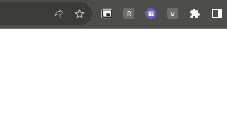

# vuex-chrome-storage

This is a simple example of usage `Vuex` with `Chrome Storage` crafted for [Medium Article](https://artemzip.medium.com/chrome-storage-with-vue-js-in-chrome-extension-ec268a5289d5). 


### How to use it

- Build it with the next cmd
   
```bash
npm run build
```

- Upload it Google Chrome as "Unpacked extension"


### Expected Result


